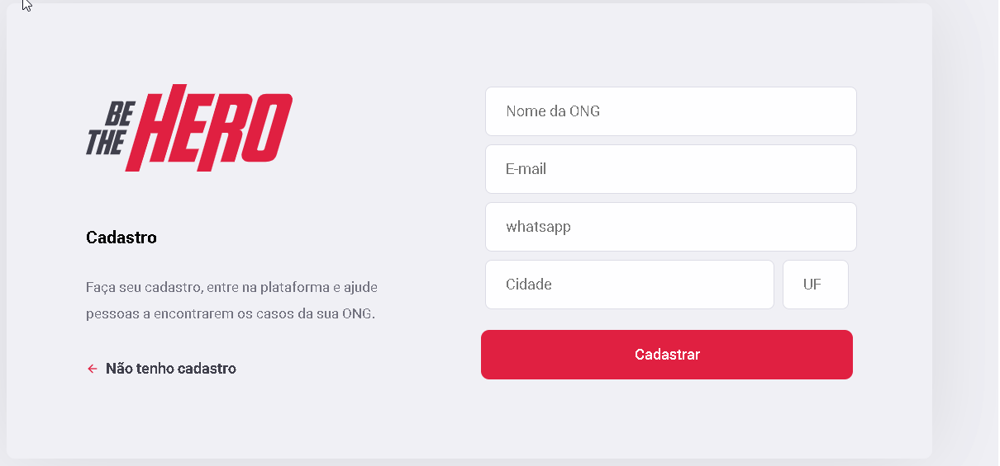

# Projeto: Be The Hero

 

# Descrição

Be The Hero é um projeto social, produzido na semana da Rocketseat, para cadastros de ongs. O objetivo do projeto é de ajudar pessoas que necessitam de recursos.

# Tecnologias Utilizadas

1. Node.JS
2. React.JS
3. React Native

# Executando o projeto

Back-end
1 - npm install para baixar todas as dependênciass.

2 - npx knex migrate:latest para executar as migrations e criar as tabelas do banco de dados.

3 - npm start Para fazer o servidor funcionar.

Front-end Web
1 - npm install para baixar todas as dependências necessárias.

2 - npm start para rodar o servidor.

# Licença

:book: Licença MIT. Veja o arquivo LICENSE.
